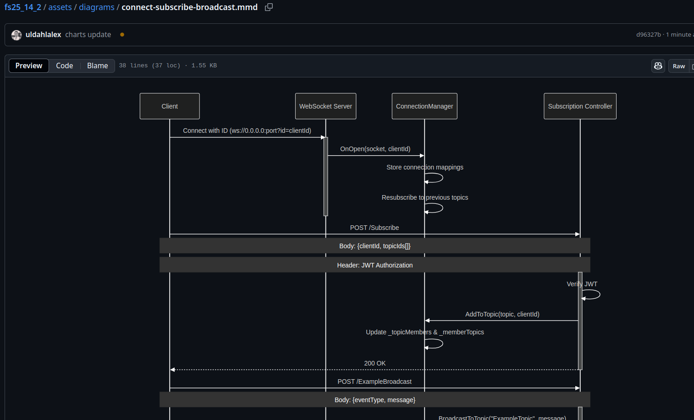

# NICE TO KNOW & RESOURCES FOR EXAM PROJECT

## My availability during project period

I will of course help with anything related to fullstack, internships, development training, etc.

- Wednesdays + Fridays I will be available 9:00 -> 11:30 in D17. (Normal fullstack hours)

- Tuesdays + Thursdays I will be available 12:00 -> 14:30 in D17. (Normal cybersecurity hours)

*The only exceptions are as listed below:*

- Easter holiday (so week 17 is when office hours start)
- 7th of May: I'll be available from 9-10 but due to a meeting at 10 o'clock I'm not availble after this.
- 27th of May (Tuesday, the day before submission): We have a guest speaker in the Innovatorium at 12 o'clock.

## Mermaid charts for common fullstack operations

In the following directory: `https://github.com/uldahlalex/fs25_14_2/tree/master/assets/diagrams`
You can find charts that describe the flow of data in a fullstack application. They can help you understand the general flow of data and how different components interact with each other.

Github can display these mermaid Charts like this: (with controls in the bottom right of each chart)

## Example codebase:

You can view the code for the weather station here:

`https://github.com/uldahlalex/fs25_14_2`

Or use the deployed app here *(with 7 second cold start for the server app, so just refresh if the deployment has been inactive)*: 

`https://easvweatherstation.web.app`

## Rules for exam:

Can be found here: `https://moodle.easv.dk/mod/page/view.php?id=178449`

## Example exam questions

Q) What is the flow of communication between client and server when using WebSockets?

Q) Who has to be the one initiating the connection (server or client?)

Q) Could you explain how the Connection Manager broadcasts to a set of clients?

Q) Could you explain what the difference is between using an Event Handler and a Controller method for communicating between a client and a server?

Q) How do you make sure the client application performs some action when they receive a certain websocket message? 

Q) How do you make sure certain clients receive a broadcast from the server?

Q) In onion architecture how can a REST API or Websocket API use concrete infrastructure services without direct access?

Q) How do you ensure access control? (Example: Unauthenticated client can't use event handler)

Q) How do you ensure websocket clients receive error response in case of an unhandled exception?

Q) What is Ping (-pong) in WebSocket communication?

*[More questions may be added at a later point in time...]*