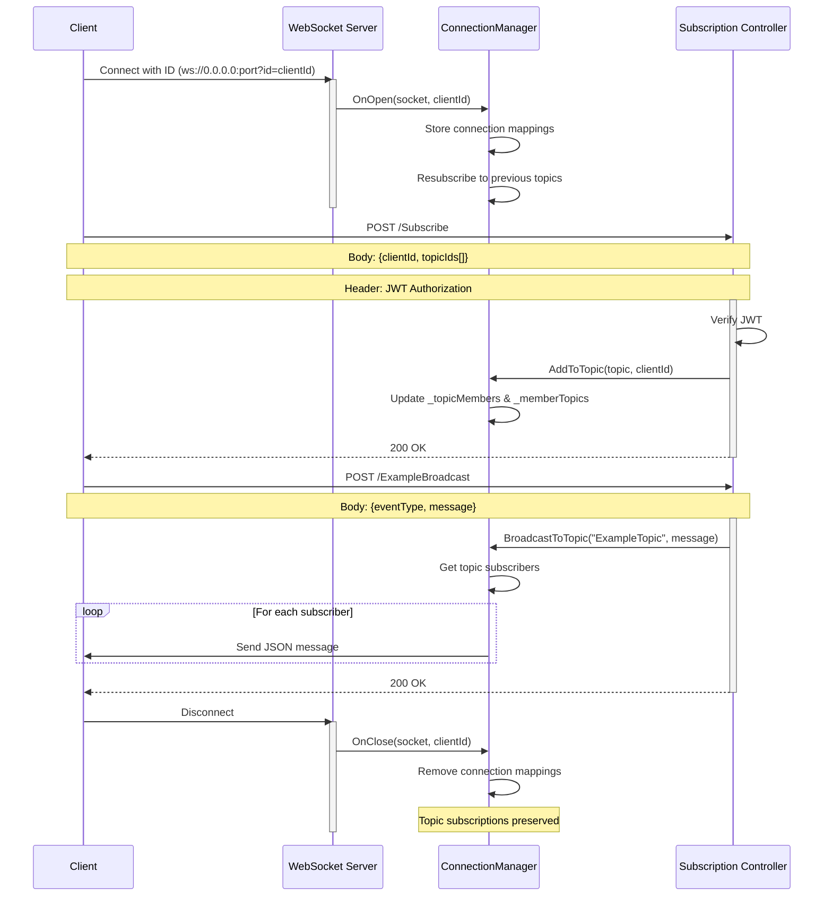

# The cookbook for fs25

```mermaid
sequenceDiagram
    participant C as Client
    participant WS as WebSocket Server
    participant CM as ConnectionManager
    participant SC as Subscription Controller

    C->>WS: Connect with ID (ws://0.0.0.0:port?id=clientId)
    activate WS
    WS->>CM: OnOpen(socket, clientId)
    CM->>CM: Store connection mappings
    CM->>CM: Resubscribe to previous topics
    deactivate WS

    C->>SC: POST /Subscribe
    Note over C,SC: Body: {clientId, topicIds[]}
    Note over C,SC: Header: JWT Authorization
    activate SC
    SC->>SC: Verify JWT
    SC->>CM: AddToTopic(topic, clientId) 
    CM->>CM: Update _topicMembers & _memberTopics
    SC-->>C: 200 OK
    deactivate SC

    C->>SC: POST /ExampleBroadcast
    Note over C,SC: Body: {eventType, message}
    activate SC
    SC->>CM: BroadcastToTopic("ExampleTopic", message)
    CM->>CM: Get topic subscribers
    loop For each subscriber
        CM->>C: Send JSON message
    end
    SC-->>C: 200 OK
    deactivate SC

    C->>WS: Disconnect
    activate WS
    WS->>CM: OnClose(socket, clientId)
    CM->>CM: Remove connection mappings
    Note over CM: Topic subscriptions preserved
    deactivate WS
```